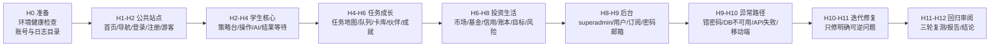

# Brown Zone 12 小时真实用户内测启动前 Review 包

生成时间：2026-07-07  
状态：等待用户 review，尚未开始 12 小时正式内测  
执行原则：必须模拟真实用户逐步使用；每个动作必须等待页面、接口、数据或错误结果真实返回后，才能进入下一步。

## 1. 本轮与历史内测的区别

项目中已经存在 2026-07-01、2026-07-02、2026-07-05 的内测报告。本轮不是简单重复跑静态检查，而是升级为更接近公司内部 QA 的长时间真实用户体验：

- 时间要求：不少于真实 12 小时。
- 行为要求：逐个使用按钮、表单、弹窗、AI、任务、支付入口和后台功能。
- 等待要求：每一步必须等待接口响应、页面状态变化、Toast、数据持久化或明确超时。
- 协作要求：按产品、前端、后端、视觉、测试、安全、发布审阅分工。
- 交付要求：输出问题清单、根因分析、修复方案、修复证据和最终内测报告。

## 2. 可视化时间线



## 3. 内部协作分工

| 角色 | 职责 | 主要证据 |
| --- | --- | --- |
| Supervisor PM | 控制节奏、记录边界、确认风险等级和完成证据 | timeline、status、round report |
| 真实用户模拟员 | 像学生、游客、管理员一样逐步点击和等待结果 | 浏览器截图、trace、API 响应 |
| 产品体验审阅 | 检查流程是否顺、文案是否像真实产品、是否符合青少年认知负荷 | 用户旅程记录 |
| 前端视觉审阅 | 检查溢出、留白、按钮状态、卡片比例、移动端体验 | 截图矩阵、overflow 检测 |
| 后端/API 审阅 | 检查登录、注册、沙盘、AI、订阅、后台接口是否真实返回 | status code、response body |
| 安全与合规审阅 | 检查密钥、支付、权限、未成年人友好、真实交易风险提示 | grep、接口权限结果 |
| 发布审阅 | 检查是否满足上线前证据，不直接部署 | build/test 结果 |

## 4. 工具与插件使用计划

| 工具 / 插件 | 使用阶段 | 用途 | 限制 |
| --- | --- | --- | --- |
| dev-supervisor | 全程 | 监工、时间线、目标、风险边界 | 必须保留当前目标，不缩小范围 |
| 浏览器 / Playwright fallback | H1-H12 | 真实点击、等待网络响应、截图、移动端视口 | 浏览器插件不可用时用 Playwright |
| superpowers | 复盘与系统性检查 | 梳理问题、识别根因、避免只修表面 | 只作为辅助，不代替证据 |
| github / coderabbit | 审阅阶段 | 对代码变更做差异审阅或生成修复建议 | 不自动 push，不替代本地验证 |
| jam | 如果有录制或可复现 UI bug | 辅助分析用户路径与视觉问题 | 没有 Jam 记录时跳过 |
| openai-developers | AI 接口异常时 | 查询官方 API 行为或兼容性 | 不直接改密钥 |
| edX / DataCamp | 教学内容参考 | 仅在需要教育内容参考时使用 | 不作为产品功能测试工具 |

## 5. 必测用户旅程

### 5.1 游客旅程

1. 打开首页。
2. 检查导航、登录弹窗、立即体验按钮。
3. 进入游客体验。
4. 等待学生端加载完成。
5. 点击任务、AI、市场和充值入口。
6. 如果进入付费路径，验证先升级为个人账号，不直接给共享游客开通权益。

### 5.2 新注册用户旅程

1. 打开注册入口。
2. 使用新邮箱注册。
3. 等待注册接口返回。
4. 确认进入学生端。
5. 检查默认沙盘、任务状态、新手引导和数据是否创建。
6. 重复邮箱注册必须返回清晰中文错误。

### 5.3 已注册学生旅程

1. 登录。
2. 策略总览：下单、储蓄、房产、创业、推回合、AI 复盘。
3. 市场信息：切换观察池、搜索、AI 解读、榜单和板块热度。
4. 任务中心：地图节点、放大地图、任务队列、翻卡、领取学习卡。
5. 财富地图：卡库、伙伴图鉴、成就墙、收益日历。
6. 生活理财：生活账本、目标账户、保护伞、信用实验室。
7. 所有页面都检查桌面、平板、手机是否无横向溢出。

### 5.4 超级管理员旅程

1. 使用 `superadmin` 登录。
2. 进入 `/admin`。
3. 搜索用户。
4. 创建用户。
5. 修改邮箱。
6. 重置密码。
7. 修改订阅 / 试用状态。
8. 普通 admin 不应拥有超级管理员写权限。

### 5.5 异常旅程

1. 错误密码。
2. 不存在账号。
3. 重复邮箱。
4. 数据库暂时不可用。
5. AI 不可用。
6. 网络慢速。
7. 移动端小屏。
8. 未登录访问受保护页面。

## 6. 等待结果规则

每个动作至少需要以下一种证据才算完成：

- URL 发生预期跳转。
- 关键元素可见。
- Toast 或错误提示出现。
- API 返回预期 status 和 body。
- 数据重新读取后与操作一致。
- local/session/cookie 状态符合预期。
- 明确超时，并记录为问题。

不允许只因为“点击后视觉看起来没坏”就判定通过。

## 7. 问题分级

| 等级 | 定义 | 示例 |
| --- | --- | --- |
| P0 | 阻断主流程或数据安全风险 | 无法登录、无法进入学生端、越权修改账号 |
| P1 | 关键功能失败或严重体验问题 | 任务无法完成、支付入口错误、AI 返回空白 |
| P2 | 明显影响使用但有绕路 | 移动端布局挤压、某按钮反馈不清晰 |
| P3 | 轻微体验/文案/测试稳定性问题 | 留白稍大、文案不够清晰 |
| P4 | 内部证据或维护问题 | 测试定位器不稳定、终端编码显示问题 |

## 8. 修复边界

允许自动修复：

- 明确复现的前端布局、按钮状态、文案、测试稳定性问题。
- 低风险、可逆、局部的 API 错误提示和输入校验问题。
- 文档和测试脚本问题。

必须暂停确认：

- 真实支付扣款。
- 生产数据库迁移或删除数据。
- 修改密钥、商户号、真实回调地址。
- 强制推送、删除分支、重写历史。
- 会影响学校真实使用数据的操作。

## 9. 计划输出物

| 文件 | 内容 |
| --- | --- |
| `.tmp/internal-qa-marathon-2026-07-07/` | 原始截图、trace、接口响应、临时日志 |
| `docs/internal-qa-marathon-2026-07-07.md` | 12 小时内测总报告 |
| `docs/internal-qa-issues-2026-07-07.md` | 问题清单、根因、修复状态 |
| `docs/internal-qa-fix-log-2026-07-07.md` | 每次修复的证据链 |

## 10. 启动条件

本计划需要用户 review 后再启动。建议回复：

```text
确认，开始12小时内测
```

如果希望先只跑本地，不碰线上，可回复：

```text
确认，仅本地12小时内测
```

如果希望线上只做只读 smoke，不做写操作，可回复：

```text
确认，本地完整内测 + 线上只读 smoke
```

